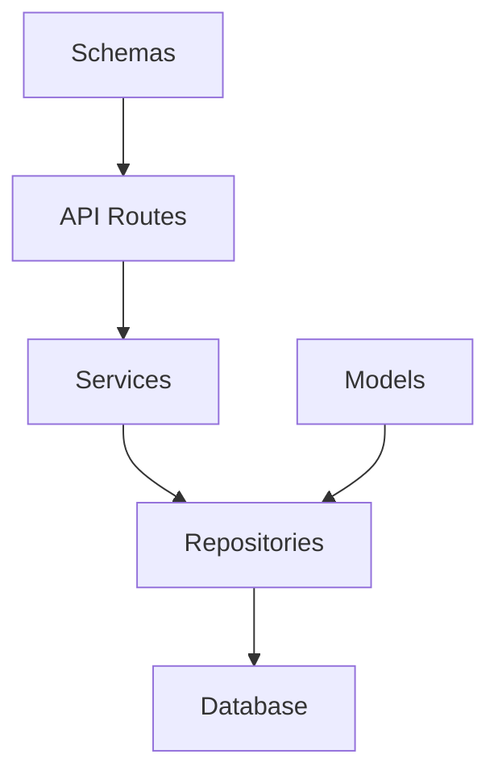

# MVP Backend Architecture

## Key Architectural Decisions

### 1. Project Organization
```
backend/
├── app/
│   ├── api/                    # API layer
│   │   ├── v1/                # API version
│   │   └── deps.py            # Dependency injection
│   ├── core/                  # Core functionality
│   │   ├── config.py          # Configuration
│   │   ├── security.py        # Security utilities
│   │   └── errors.py          # Error definitions
│   ├── models/                # Database models
│   │   ├── base.py           
│   │   └── mixins.py
│   ├── schemas/               # Pydantic schemas
│   ├── services/              # Business logic
│   ├── repositories/          # Data access
│   └── utils/                 # Shared utilities
├── tests/                     # Test suite
└── alembic/                   # Database migrations
```

### 2. Layer Separation



#### API Layer
- Route definitions only
- Request/response handling
- Input validation
- Dependency injection
- No business logic

#### Service Layer
- Business logic implementation
- Transaction management
- Cross-cutting concerns
- No direct database access

#### Repository Layer
- Database operations
- Query construction
- Data mapping
- Reusable data access

### 3. Design Patterns

#### Dependency Injection
```python
# Example dependency structure
def get_repository():
    return Repository()

def get_service(repo: Repository = Depends(get_repository)):
    return Service(repo)

@router.get("/")
def endpoint(service: Service = Depends(get_service)):
    return service.operation()
```

#### Repository Pattern
```python
# Example repository interface
class Repository(Protocol):
    def get(self, id: int) -> Model:
        ...
    def create(self, data: dict) -> Model:
        ...
```

#### Service Layer Pattern
```python
# Example service structure
class Service:
    def __init__(self, repository: Repository):
        self.repository = repository

    def operation(self, data: dict) -> Any:
        # Business logic here
        pass
```

### 4. Testing Strategy

#### Test Organization
```
tests/
├── conftest.py               # Shared fixtures
├── unit/                    # Unit tests
│   ├── services/
│   └── repositories/
├── integration/             # Integration tests
│   └── api/
└── fixtures/               # Test data
```

#### Testing Principles
- Unit tests for business logic
- Integration tests for APIs
- Fixtures over mocks when possible
- One assert per test
- Descriptive test names
- Isolated test database

## Core Infrastructure Components

### Database Access
- SQLModel for models
- Repository pattern for queries
- Explicit transaction management
- Migration tracking with Alembic

### Error Handling
- Custom exception classes
- Global exception handler
- Structured error responses
- Detailed logging

### Authentication
- JWT token-based
- Role-based access control
- Simple permission model
- Session management

### Configuration
- Environment-based config
- Pydantic settings model
- Type-safe configuration
- Secrets management

## Development Guidelines

### Code Organization
- Single responsibility principle
- Dependency injection
- Interface segregation
- Explicit dependencies

### Coding Standards
- Type hints everywhere
- Docstring for public APIs
- Consistent naming conventions
- Black for formatting
- Ruff for linting

### Documentation
- OpenAPI/Swagger docs
- README.md in each module
- API endpoint documentation
- Type hint documentation

## Testing Guidelines

### Unit Testing
- Test business logic in isolation
- Mock external dependencies
- Focus on edge cases
- Fast execution

### Integration Testing
- Test API endpoints
- Use test database
- Test happy paths
- Verify error responses

### Test Coverage
- Minimum 80% coverage
- Critical paths 100%
- Integration test core flows
- Report coverage metrics