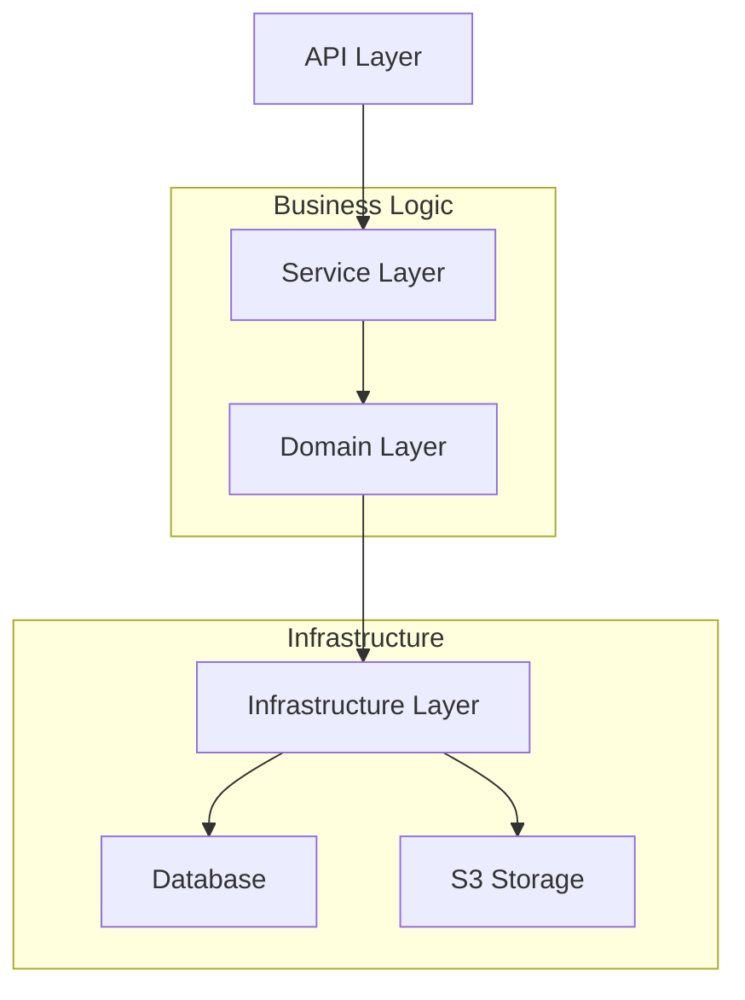
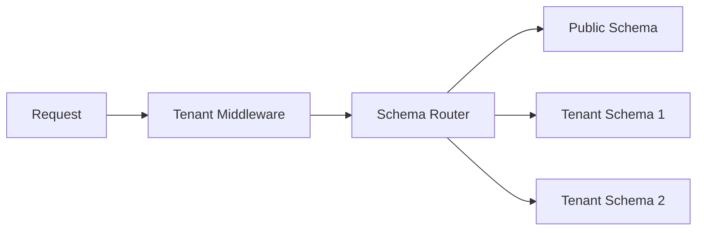
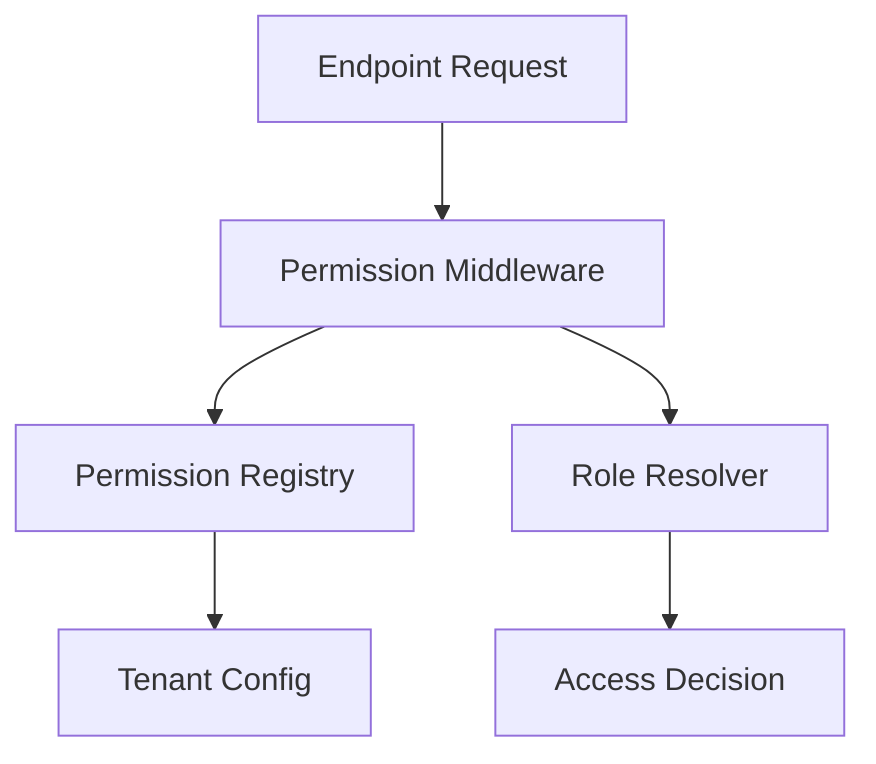

# Backend Technical Design Document

## Core Dependencies

### Framework and API
- **FastAPI**: Main web framework
  - Request handling and routing
  - Dependency injection
  - OpenAPI/Swagger integration
  - WebSocket support
  - Background tasks

### Database and ORM
- **SQLModel + SQLAlchemy**: Database ORM and modeling
  - Model definitions
  - Query building
  - Relationship management
  - Type safety integration
  
- **Alembic**: Database migrations
  - Schema version control
  - Migration generation
  - Upgrade/downgrade operations
  - Multi-tenant schema management

### File and Media Handling
- **python-multipart**: File upload handling
  - Multipart form data processing
  - File streaming
  - Memory-efficient uploads

- **boto3**: AWS S3 Integration
  - File storage operations
  - Bucket management
  - Access control
  - Pre-signed URLs

### Email and Templates
- **emails**: Email handling
  - SMTP integration
  - HTML email support
  - Email queue management
  
- **Jinja2**: Template engine
  - Email template rendering
  - Dynamic content generation
  - Template inheritance
  - Custom filters and extensions

### Security and Authentication
- **python-jose[cryptography]**: JWT handling
  - Token generation and validation
  - Encryption/decryption
  
- **passlib[bcrypt]**: Password hashing
  - Secure password storage
  - Hash verification
  
- **python-multipart**: Form data parsing
  - Authentication request handling

### Caching and Performance
- **Redis**: Distributed caching
  - Session storage
  - Rate limiting
  - Cache invalidation

### Testing and Quality
- **pytest**: Testing framework
  - Unit testing
  - Integration testing
  - Fixtures and mocking
  
- **httpx**: HTTP client
  - API testing
  - External service integration
  
- **coverage**: Code coverage
  - Test coverage reporting
  - Coverage enforcement

## Architecture Overview



## Core Architectural Principles

### Domain-Driven Structure
- Root directory organization by domain contexts
- Each domain module is self-contained with its routes, services, models, and repositories
- Cross-cutting concerns handled via middleware and shared utilities

```
app/
├── domains/
│   ├── auth/
│   ├── users/
│   ├── permissions/
│   ├── files/
│   └── tenant/
├── core/
├── infrastructure/
└── shared/
```

### Layer Separation

1. **API Layer**
   - Route definitions and request/response handling
   - Input validation and serialization
   - Authentication and authorization middleware
   - API documentation via OpenAPI/Swagger

2. **Service Layer** 
   - Business logic orchestration
   - Transaction management
   - Cross-domain coordination
   - Event handling and dispatching

3. **Domain Layer**
   - Business entities and value objects
   - Domain-specific business rules
   - Interface definitions for repositories

4. **Infrastructure Layer**
   - Database operations and migrations
   - External service integrations
   - Caching implementation
   - File storage operations

## Multi-Tenant Architecture



### Schema Design
- Public schema for shared tables
  - Tenant registry
  - Global configurations
  - Shared lookup tables

- Tenant-specific schemas
  - Isolated data per tenant
  - Independent configurations
  - Tenant-specific business data

### Tenant Resolution
- Header-based tenant identification
- Tenant context middleware
- Dynamic schema switching
- Connection pooling per tenant

## Permission System



### Components
- Permission registry for endpoint-based access control
- Role-based access control (RBAC) implementation
- Tenant-specific permission configurations
- Permission inheritance and hierarchy support
- Caching layer for permission checks

## Data Persistence

### Database Design
- SQLAlchemy for ORM and query building
- SQLModel for Pydantic integration
- Alembic for schema migrations
- Transaction management and unit of work pattern
- Query optimization and indexing strategies

### Caching Strategy
- Multi-level caching approach
- Redis for distributed caching
- Local memory caching for frequently accessed data
- Cache invalidation patterns

## File Storage Integration

### S3 Integration
- Abstracted storage interface
- Tenant-specific bucket/prefix strategy
- File metadata tracking
- Access control and signed URLs
- Bulk operation support

## Error Handling & Logging

### Error Management
- Standardized error response format
- Domain-specific error types
- Error tracking and monitoring
- Graceful degradation strategies

### Logging System
- Structured logging format
- Log levels and categorization
- Correlation IDs for request tracking
- Performance monitoring integration

## Security Implementation

### Authentication
- JWT-based authentication
- Token refresh mechanism
- Session management
- MFA support structure

### Authorization
- Role-based access control
- Permission verification middleware
- Resource-level access control
- Audit logging

## Code Generation & CLI Tools

### Template System
- Code generation templates for:
  - Domain modules
  - CRUD operations
  - Service layers
  - Test structures

### CLI Features
- Module scaffolding
- Migration management
- Tenant operations
- Permission management

## Testing Strategy

### Test Categories
- Unit tests for domain logic
- Integration tests for services
- API tests for endpoints
- Performance tests for critical paths

### Testing Principles
- Isolated test environments per tenant
- Mock external dependencies
- Fixture-based test data
- Parallel test execution support

## API Documentation

### Documentation Approach
- OpenAPI/Swagger integration
- Automated documentation generation
- Interactive API documentation
- Code example generation

## Performance Considerations

### Optimization Strategies
- Query optimization
- Caching strategies
- Lazy loading patterns
- Bulk operation support
- Connection pooling
- Resource monitoring