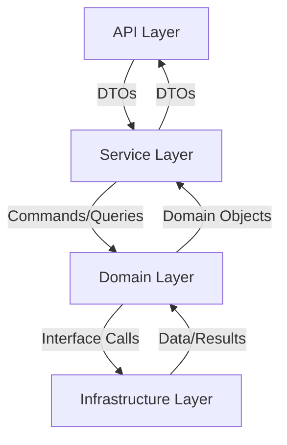

# Layer Boundaries Definition

## Layer Interaction Rules

### 1. API Layer (Presentation)
**Responsibilities:**
- Route definitions and endpoint handlers
- Request/response DTOs (using Pydantic schemas)
- Input validation and sanitization
- Authentication middleware
- Authorization checks
- API documentation (OpenAPI/Swagger)

**Boundaries:**
- Can ONLY interact with Service Layer
- Must NOT contain business logic
- Must NOT directly access repositories or databases
- Must handle HTTP-specific concerns only
- Must use dependency injection for Service Layer access

**Example:**
```python
@router.post("/users")
def create_user(
    user_data: UserCreate,
    service: UserService = Depends(get_user_service)
):
    return service.create_user(user_data)
```

### 2. Service Layer (Application)
**Responsibilities:**
- Business logic orchestration
- Transaction management
- Cross-domain coordination
- Event handling/dispatching
- Input/output port definitions
- Use case implementations

**Boundaries:**
- Can interact with Domain Layer
- Can coordinate multiple repositories
- Must NOT have HTTP/presentation concerns
- Must NOT directly access infrastructure
- Must use repository interfaces, not implementations

**Example:**
```python
class UserService:
    def __init__(self, user_repo: UserRepository, event_publisher: EventPublisher):
        self._user_repo = user_repo
        self._event_publisher = event_publisher
    
    def create_user(self, user_data: UserCreate) -> User:
        user = User.create(user_data)  # Domain entity
        saved_user = self._user_repo.save(user)
        self._event_publisher.publish(UserCreated(saved_user.id))
        return saved_user
```

### 3. Domain Layer (Business)
**Responsibilities:**
- Business entities and value objects
- Domain-specific business rules
- Domain events
- Repository interfaces
- Domain service interfaces
- Business invariants enforcement

**Boundaries:**
- Must be pure Python (no frameworks)
- Must NOT have external dependencies
- Must NOT know about persistence
- Must NOT have infrastructure concerns
- Must contain only business logic

**Example:**
```python
class User:
    def __init__(self, email: str, password: str):
        self._validate_email(email)
        self.email = email
        self.password_hash = self._hash_password(password)
    
    @staticmethod
    def _validate_email(email: str) -> None:
        if not email or '@' not in email:
            raise ValueError("Invalid email format")
```

### 4. Infrastructure Layer (Data & External Services)
**Responsibilities:**
- Database implementations
- External service integrations
- Caching implementations
- File storage operations
- Repository implementations
- Event publisher implementations
- Email service implementations

**Boundaries:**
- Must implement interfaces defined in Domain Layer
- Must NOT be directly accessed by API or Service layers
- Must handle all external system interactions
- Must manage infrastructure concerns

**Example:**
```python
class PostgresUserRepository(UserRepository):
    def __init__(self, db_session: Session):
        self._session = db_session
    
    def save(self, user: User) -> User:
        db_user = UserModel.from_domain(user)
        self._session.add(db_user)
        return db_user.to_domain()
```

## Cross-Cutting Concerns

### 1. Dependency Injection
- All dependencies must be injected through constructors or FastAPI's dependency injection
- Implementation details should be resolved at composition root
- Each layer should depend on abstractions, not implementations

### 2. Error Handling
- Domain Layer: Raises domain-specific exceptions
- Service Layer: Translates domain exceptions to application exceptions
- API Layer: Converts application exceptions to HTTP responses

### 3. Validation
- API Layer: Request data validation (Pydantic)
- Domain Layer: Business rule validation
- Service Layer: Use case-specific validation

### 4. Transaction Management
- Handled at Service Layer
- Unit of Work pattern implementation
- Consistent transaction boundaries

## Communication Flow



## Layer Access Rules

1. Each layer can only depend on the layer directly below it
2. Domain Layer has no dependencies on other layers
3. Dependencies flow inward toward Domain Layer
4. Outer layers must use interfaces to access inner layer functionality
5. Cross-cutting concerns are accessed through dependency injection

## Implementation Guidelines

1. **Clear Namespace Separation**
   - Each layer in its own module/package
   - Clear import boundaries
   - No circular dependencies

2. **Interface Segregation**
   - Small, focused interfaces
   - Layer-specific interfaces
   - Clear contracts between layers

3. **Dependency Management**
   - Explicit dependencies
   - Constructor injection
   - Interface-based dependencies

4. **Testing Considerations**
   - Each layer testable in isolation
   - Mocking at layer boundaries
   - Integration tests across layers

These boundaries ensure:
- Clear separation of concerns
- Maintainable and testable code
- Scalable architecture
- Domain-driven design principles
- Flexible and modular system